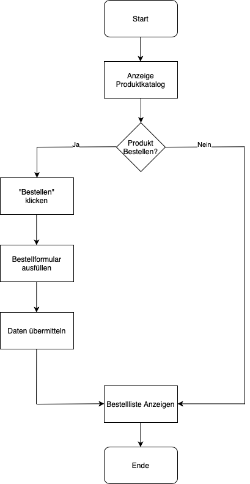
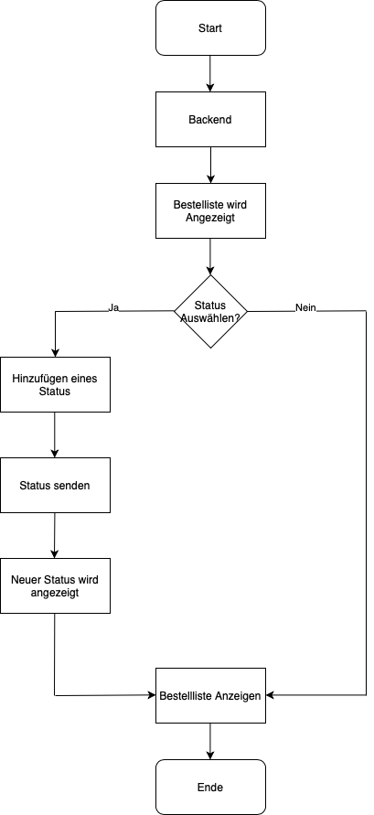

# Projekt Online Shop

### 1. Ausgangslage des Projektes 

   Unser Familienunternehmen Herzog & Loibner ist ein Juwelier-Geschäft und befindet sich im
   Herzen von Vaduz. Vor fünf Jahren haben wir unsere eigene Schmuckmarke „Aldusblatt“ ins Leben gerufen. Es handelt
   sich hierbei um hochwertigen 18-Karat Schmuck. Um die Aldusblatt-Kollektion weiter zu vermarkten, möchte unser
   Familienunternehmen unseren Kunden einen Online-Shop zur Verfügung stellen. Im Shop können die Produkte ausgewählt und mittels Versand an die jeweilige
   Adresse geliefert werden.

### 2. Projektidee 

   Der Online-Shop ist so aufgebaut, dass auf der Startseite die verschiedenen Produktmöglichkeiten mit
   Informationen aufgezeigt werden. Nun hat man die Möglichkeit ein Produkt auszuwählen und gelangt somit auf das
   Bestell-Formular. Für eine neue Bestellung werden alle Felder, vom Name bis Anzahl, vollständig ausgefüllt.
   Zusätzlich bietet der Shop auch eine kostenlose Gravur an. Falls keine Gravur gewünscht wird, lässt der Kunde das
   Feld leer. Sind alle Daten erfasst, können diese in der Bestellübersicht veranschaulicht werden.

   Der Shop Moderator hat nun die Möglichkeit, intern die Bestellliste im Backend einzusehen. Da das bestellte Produkt an die angegebene Adresse versendet wird,
   muss zuerst geklärt werden, ob sich dieses Produkt an Lager befindet. Somit kann der Shop Moderator in der Bestellübersicht
   folgende Funktionen auswählen: nicht an Lager, an Lager und versendet. Diese Daten werden gespeichert und in der
   Bestellübersicht unter Status aufgezeigt. 

### 3. Ablaufdiagramm 

Produktbestellung:




Backend Funktion: 




### 4. Anleitung/Walkthrough

### Installation & Benutzung

* Downloaden Sie das Verzeichnis "Projekt". (https://github.com/unicorni11/pythonproject.git)

* Starten Sie die Python-Datei "main.py" auf ihrem Rechner.

* Öffnen Sie diesen Link via Webbrowser: "http://127.0.0.1:5000"

* Im Verzeichnis wurden aktuell Beispieldaten abgelegt. Nun können Sie über das Bestellformular weitere Einträge generieren. 


### Funktionsbeschreibung

Damit das Programm einwandfrei funktioniert, muss in der Main-Datei nebst Flask auch, Json, datetime und Plotly Express
installiert bzw. importiert werden.

```from flask import
Flask from flask import render_template 
from flask import request, redirect 
import json 
from datetime import datetime import 
plotly.express as px 
from plotly.offline import plot 
```

#### Startseite (index.html)
* Hier befindet sich der Produktkatalog zur Veranschaulichung der auszuwählenden Produkten mit Preis. 

* Mit einem Klick auf „Bestellen“ wird man auf das Bestellformular geführt.

#### Daten der Bestellung erfassen (formular.html)
* Mit Hilfe von diesem Formular werden die notwendigen Daten über die Bestellung erfasst. 

* Name: Name der Person (z.B. Anna-Lena Loibner)

* Adresse: Adresse der Person (z.B. Riedstrasse 2)

* Produktauswahl: Produkt und Material des Produktes wird bestimmt. 

* Anzahl: die gewünschte Anzahl des Produktes

* Gravur: Wer möchte, kann eine Gravur hinzufügen. Ansonsten bleibt das Feld leer und in der Bestellliste wird „keine
Gravur“ angezeigt.

#### Bestellübersicht (bestellungen.html)
* Zur Veranschaulichung der eingegangen Bestellungen .

#### Backend (backend.html)
* Hier wird der Status der Bestellung erfasst und aufgelistet.

* Über das Statusformular „Auswahl“ kann zwischen: nicht
an Lager, an Lager und versendet ausgewählt werden. 

* Danach wird im Bereich „Status“ die aktuelle Situation der
Bestellung aufgelistet.

#### Visualisierung (visualisierung.html)
* Die Datenvisualisierung veranschaulicht eine Auflistung der einzelnen Umsätze der Produkte sowie den
Gesamtumsatz.
* Mittels Plotly wurde ein Balkendiagramm erstellt. 

#### Bootstrap

Bootstrap ist ein kostenloses und quelloffenes Frontend-Web-Framework zur Erstellung von Webseiten. Es dient der
Visualisierung und schöneren Darstellung. Der Link wurde hierbei im Header eingefügt.


